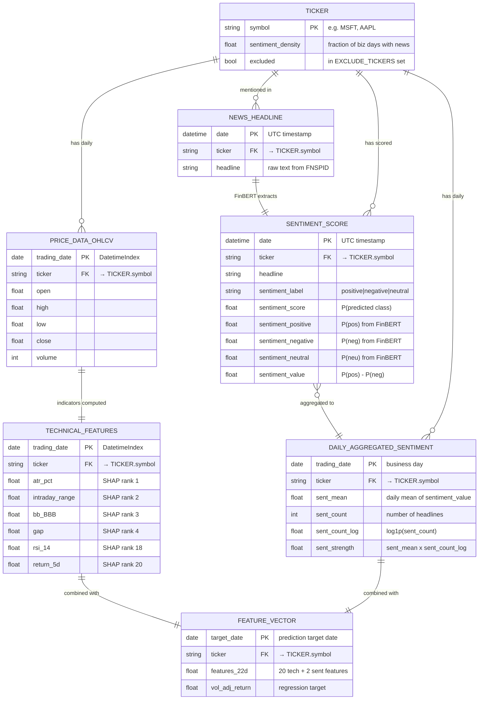
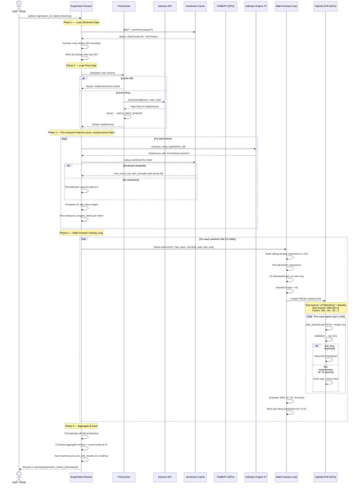

# Data Model & Dynamic Model — Thesis Sections 3.1 & 3.3

> [!NOTE]
> All schemas, types, and relationships below were derived from live inspection of the codebase, including `pd.read_parquet()` on actual cached files. LaTeX/TikZ equivalents are provided at the end.

---

## 3.1 Data Model

### Cached File Schemas

The system uses a **three-layer caching architecture**. Each layer has a distinct storage format and schema.

#### Layer 1 — Price Cache (`data/price_cache/`)

| Aspect | Detail |
|---|---|
| **Format** | Python Pickle (`.pkl`) |
| **Structure** | `Dict[str, pd.DataFrame]` — keys are ticker symbols, values are OHLCV DataFrames |
| **Key** | `prices_{start_date}_{end_date}{suffix}.pkl` |
| **Example** | `prices_2012-01-01_2019-12-31.pkl` (14 MB, ~150 stocks) |

**Per-ticker DataFrame schema (DatetimeIndex):**

| Column | Dtype | Description |
|---|---|---|
| *(index)* | `DatetimeIndex` | Trading day |
| `Open` | `float64` | Opening price |
| `High` | `float64` | Intraday high |
| `Low` | `float64` | Intraday low |
| `Close` | `float64` | Closing price |
| `Volume` | `int64` | Trading volume |
| `Ticker` | `str` | Stock symbol |

---

#### Layer 2 — Sentiment Cache (`data/cache/sentiment/`)

Three Parquet files per ticker: `{TICKER}_news.parquet`, `{TICKER}_sentiment.parquet`, `{TICKER}_prices.parquet`.

**`{TICKER}_news.parquet` — Raw headlines (pre-FinBERT):**

| Column | Dtype | Description |
|---|---|---|
| `date` | `datetime64[ns, UTC]` | Publication timestamp (UTC) |
| `headline` | `str` | Raw headline text from FNSPID |
| `ticker` | `str` | Stock symbol |

**`{TICKER}_sentiment.parquet` — FinBERT-enriched headlines:**

| Column | Dtype | Description |
|---|---|---|
| `date` | `datetime64[ns, UTC]` | Publication timestamp (UTC) |
| `headline` | `str` | Raw headline text |
| `ticker` | `str` | Stock symbol |
| `sentiment_label` | `str` | Predicted class: `"positive"`, `"negative"`, `"neutral"` |
| `sentiment_score` | `float64` | Probability of the predicted class ∈ [0, 1] |
| `sentiment_positive` | `float64` | P(positive) ∈ [0, 1] |
| `sentiment_negative` | `float64` | P(negative) ∈ [0, 1] |
| `sentiment_neutral` | `float64` | P(neutral) ∈ [0, 1] |
| `sentiment_value` | `float64` | Signed polarity: `P(pos) − P(neg)` ∈ [−1, +1] |

**`{TICKER}_prices.parquet` — OHLCV from yfinance (per-ticker copy):**

| Column | Dtype | Description |
|---|---|---|
| `date` | `datetime64[ns, America/New_York]` | Trading day (US/Eastern) |
| `open` | `float64` | Opening price |
| `high` | `float64` | Intraday high |
| `low` | `float64` | Intraday low |
| `close` | `float64` | Closing price |
| `volume` | `int64` | Trading volume |
| `dividends` | `float64` | Dividends paid |
| `stock_splits` | `float64` | Split factor |
| `ticker` | `str` | Stock symbol |

---

#### Layer 3 — Feature Cache (`data/feature_cache/`)

| Aspect | Detail |
|---|---|
| **Format** | NumPy compressed archive (`.npz`) |
| **Key** | `features_v7_{N}stocks_{start}_{end}.npz` |
| **Contents** | `X` (float32), `y` (float32/int64), `feature_cols` (str[]), `tickers` (str[]) |

---

### Entity-Relationship Diagram



### FinBERT Score Storage Detail

The FinBERT scores are stored **alongside their source timestamp** in the per-ticker sentiment Parquet files. The key data structure is:

```
{TICKER}_sentiment.parquet
├── date: datetime64[ns, UTC]      ← Original publication timestamp
├── headline: str                  ← Source text (retained for debugging)
├── sentiment_label: str           ← Argmax class label
├── sentiment_score: float64       ← Confidence of predicted class
├── sentiment_positive: float64    ← P(positive)  ┐
├── sentiment_negative: float64    ← P(negative)  ├─ Full softmax triple
├── sentiment_neutral: float64     ← P(neutral)   ┘
└── sentiment_value: float64       ← P(pos) - P(neg), the signed polarity
```

Each row is a **single headline** scored by FinBERT. Multiple rows may share the same timestamp (multiple headlines published simultaneously). The `date` column preserves the original UTC publication time to sub-minute precision. During aggregation, `date` is normalised to the corresponding business day (`trading_date`) for alignment with price data.

---

## 3.3 Dynamic Model

### UML Sequence Diagram — Full Pipeline



### Statechart — Lifecycle of a Single Data Point

This diagram traces a single news headline from raw text to its final role as a component in a model feature vector.

```mermaid
stateDiagram-v2
    [*] --> RawHeadline: FNSPID CSV ingested

    state "Raw Headline" as RawHeadline {
        note right of RawHeadline
            Fields: date (UTC), headline (str), ticker (str)
            Storage: {TICKER}_news.parquet
        end note
    }

    RawHeadline --> Tokenised: WordPiece tokeniser (max 512 tokens)

    state "Tokenised Sequence" as Tokenised {
        note right of Tokenised
            input_ids, attention_mask
            On GPU (CUDA)
        end note
    }

    Tokenised --> ScoredHeadline: FinBERT forward pass (GPU)

    state "Scored Headline" as ScoredHeadline {
        note right of ScoredHeadline
            + sentiment_label, sentiment_score
            + sentiment_positive/negative/neutral
            + sentiment_value = P(pos) - P(neg)
            Storage: {TICKER}_sentiment.parquet
        end note
    }

    ScoredHeadline --> DailyAggregated: Group by trading_date, compute mean/count

    state "Daily Aggregated" as DailyAggregated {
        note right of DailyAggregated
            sent_mean, sent_count
            sent_count_log = log1p(count)
            sent_strength = mean × count_log
        end note
    }

    DailyAggregated --> DecayFilled: Forward-fill gaps with 0.95^d decay

    state "Decay-Filled Signal" as DecayFilled {
        note right of DecayFilled
            Complete business-day index
            No NaN gaps remaining
            Sentiment fades gradually
        end note
    }

    DecayFilled --> FeatureSelected: RF permutation importance selects top 2

    state "Selected Features" as FeatureSelected {
        note right of FeatureSelected
            sent_count_log (perm rank 1)
            sent_strength  (perm rank 2)
        end note
    }

    FeatureSelected --> MergedVector: Concatenate with 20 SHAP tech features

    state "22-D Feature Vector" as MergedVector {
        note right of MergedVector
            [20 technical | 2 sentiment]
            Per trading day, per ticker
        end note
    }

    MergedVector --> Scaled: StandardScaler (z-score, per-fold)

    state "Normalised Vector" as Scaled {
        note right of Scaled
            Zero mean, unit variance
            Fitted on train data only
        end note
    }

    Scaled --> Sequenced: Sliding window (L=20 days)

    state "Input Sequence" as Sequenced {
        note right of Sequenced
            Shape: (20, 22) = (seq_len, features)
            Target: vol_adj_return at day t+L
        end note
    }

    Sequenced --> ModelInput: Batched (batch_size=1024)

    state "Model Input Tensor" as ModelInput {
        note right of ModelInput
            Shape: (B, 20, 22) float32
            Split: x[:,:,:20] → Tech branch
                   x[:,:,20:] → Sent branch
        end note
    }

    ModelInput --> [*]: Fed to HybridLSTM for training/inference
```

---

